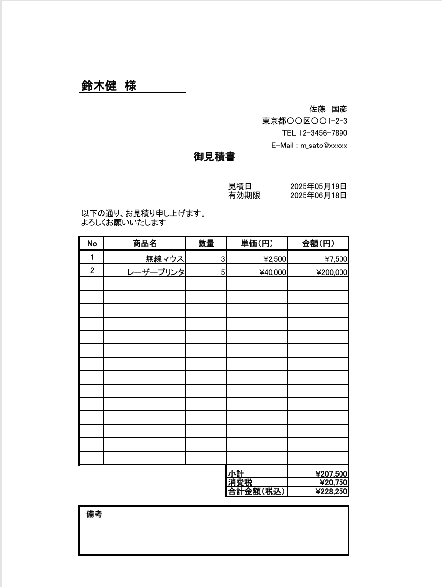
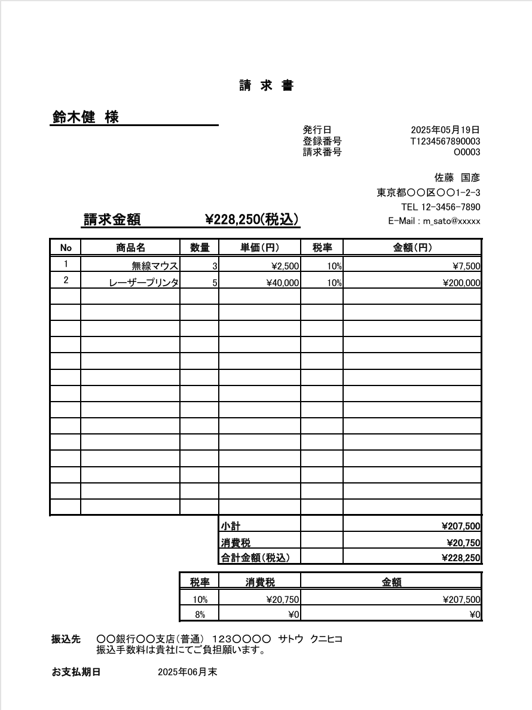

#  請求書・見積書 自動作成ツール

## ・ 概要

本ツールは、顧客からの注文情報と商品マスタをもとに、Excel形式の見積書・請求書を自動生成するツールです。  
非技術者の方でも、バッチファイルをダブルクリックするだけで帳票を出力できます。

---

## ・ 使用環境

- OS：Windows 10 / 11
- Python環境：Anaconda3（base環境）
- 実行形式：`.py`（Pythonスクリプト） + `.bat`（実行補助バッチファイル）

---

## ・ フォルダ構成

<pre lang="markdown">05_invoice_generator/
├── input/ # 注文情報・商品マスタ（CSV）
│ ├── orders.csv
│ └── products.csv
│
├── output/ # 出力帳票（Excelファイル）
│ └── O0001_quotation.xlsx など
│
├── template/ # 帳票テンプレート（Excel）
│ └── quotation_template.xlsx
│
├── script/ # スクリプト本体
│ ├── quotation_generator.py
│ ├── invoice_generator.py
│ └── common_utils.py
│
├── run_quotation.bat # 見積書を生成するバッチ
├── run_invoice.bat # 請求書を生成するバッチ
└── README.md</pre>
  
> ※ script/に、開発段階で使用した.ipynbファイルを開発ログとして保存してあります。

---

## ・ 必要な事前準備（初回のみ）

### 1. [Anaconda（最新版）をインストール](https://www.anaconda.com/download)

- 公式サイトから Windows 版 Anaconda をダウンロードしてインストールします
- 基本は「Next」連打でOKです

### 2. 環境変数の設定（必要に応じて）

- Anacondaの `python` を使うには、環境変数 `Path` に以下を含める必要があります：

<pre lang="markdown">C:\Users\＜ユーザー名＞\anaconda3
C:\Users\＜ユーザー名＞\anaconda3\Scripts</pre>

※インストール時に「Add to PATH」にチェックを入れていれば不要です

---

## ・ バッチファイルによる実行手順

### 見積書を作成する場合：

1.  `run_quotation.bat` をダブルクリック
2. 「注文IDを入力してください：」と表示されたら、例：`O0001` などを入力してEnter
3. `output/` フォルダに見積書（Excel形式）が出力されます

### 請求書を作成する場合：

1. `run_invoice.bat` をダブルクリック
2. 同様に注文IDを入力 → Excel出力

---

## ・ 出力例

> ※ 実際の出力は `template/quotation_template.xlsx` をベースにしています

---

## ・ トラブルシューティング

| 症状                                  | 対処方法                                                 |
|---------------------------------------|----------------------------------------------------------|
| 「pythonが認識されない」と表示される   | 環境変数PathにAnacondaのパスが通っているか確認         |
| `ModuleNotFoundError: pandas` 等      | Anaconda base環境が有効になっていない可能性あり        |
| ファイルが出力されない                | `output/` フォルダが作成されているか確認               |
| 注文IDを入力しても反応がない          | スクリプトで `input()` 処理が呼ばれているか確認        |

---

## ・ ライセンス

本プロジェクトは [MITライセンス](LICENSE) のもとで公開されています。  
商用・非商用を問わずご自由にご利用いただけますが、再配布時はクレジットの記載をお願いします。
